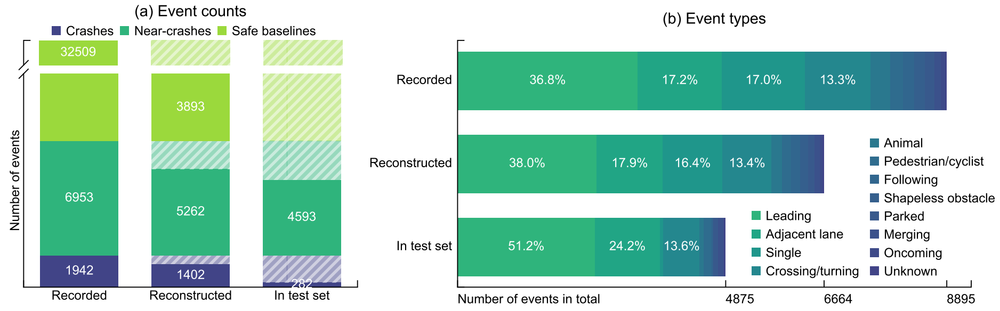
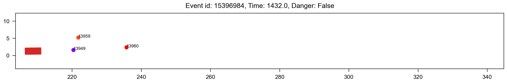
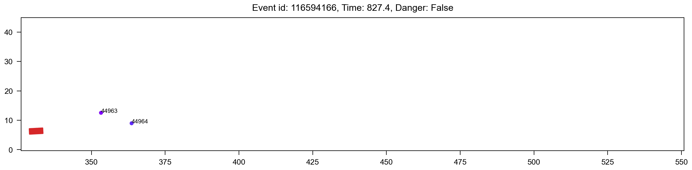
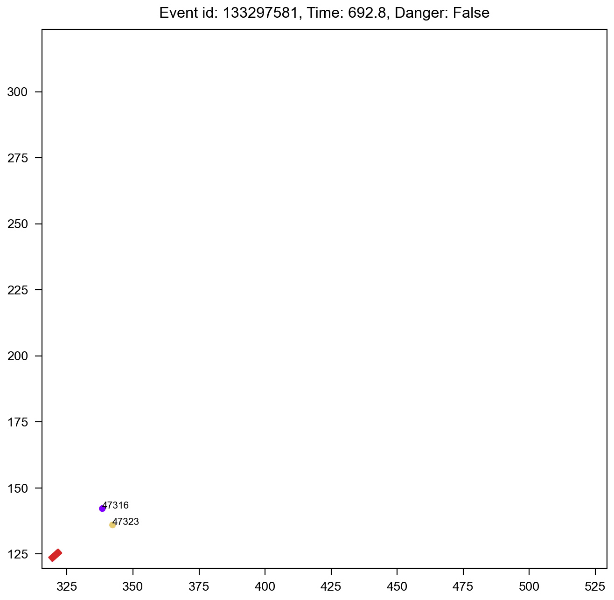

# BirdsEyeTrajectoryReconstructionSHRP2NDS
This repository provides information and guidelines to use the reconstructed trajectories of naturalistic crashes and near-crashes in the SHRP2 NDS. The dataset itself is published by the Virginia Tech Transportation Institute (VITTI) at https://doi.org/10.15787/VTT1/EFYEJR. To legally use the data, one is required to obtain a SHRP2 Data Use License (DUL) since part of the original data is included in the processed dataset. Below you will find a concise overview of the dataset, a step‑by‑step DUL application guide, a structure description of the dataset, and pointers to the reconstruction method and data dictionary.

### Event statistics
<p align="center">
  
</p>

### Quick navigation
- [1. About the SHRP2 NDS](#1-About-SHRP2-NDS)
- [2. What’s in the reconstructed dataset](#2-Reconstructed-data-overview)
- [3. Summary of useful information](#3-Summary-of-useful-information)
- [4. How to get a Data Use License](#4-DUL-application)
- [5. Structure preview of the dataset](#5-Structure-preview-of-the-dataset)
- [6. Method summary & data dictionary](#6-Method-summary-and-data-dictionary)
- [7. Citation](#7-Citation)
- [References](#References)

### Important notes
- [Note on perception data](#22-note-on-perception-data)
- [Note on data quality](#24-Note-on-data-quality)


## 1 About SHRP2 NDS
[SHRP2 NDS](https://highways.dot.gov/safety/data-analysis-tools/rsdp/rsdp-tools/strategic-highway-research-program-shrp2) is abbreviated from the Second Strategic Highway Research Program’s (SHRP2) Naturalistic Driving Study (NDS). It collected data with 3,300+ drivers' participation between 2010 and 2013 across six U.S. states. The participants' personal vehicles were equipped with data acquisition systems that recorded video footage, vehicle network data (e.g., speed, brake, and accelerator positions), and signals from additional sensors such as forward radar and accelerometers. A unique asset of SHRP2 NDS is the **manually annotated safety‑critical events**, i.e., crashes and near‑crashes, along with safe baseline segments for parallel comparison. For a full technical description of SHRP2 NDS, see [^1].

## 2 Reconstructed data overview

### 2.1 Number of events
|        Number of events       | Originally recorded | Subject-vehicle reconstructed | Both subject and object reconstructed |
|------------------------------|------:|--------------------------:|---------------------:|
| **Safe baselines**           | 32,509 | 10,919 | 3,893 |
| **Safety-critical**          | 8,895 | 8,111 | 6,664 |
| &nbsp;&nbsp;-**Crashes**     | 1,942 | 1,807 | 1,042 |
| &nbsp;&nbsp;-**Near-crashes**| 6,953 | 6,304 | 5,262 |

This dataset contains reconstructed bird's eye view trajectories (at 10 fps) of 10,919 safe baseline trips and 8,111 trips involving safety-critical events (crashes and near-crashes). Among all the trips, 3,893 safe baseline trips have both the subject vehicle and at least one surrounding object reconstructed; and for safety-critical trips the number is 6,664, including 1,402 crashes and 5,262 near-crashes. The dataset is processed from two existing datasets that were derived from SHRP2 NDS [^2][^3].

### 2.2 Note on perception data
We would like to note that this dataset mainly contains Bird's Eye View (BEV) trajectories along with event information, and perception data such as video footage are not included. In case you are interested in perception data, please also apply for DULs of the basis datasets that this current dataset is built upon, i.e., [^2] and [^3].

### 2.3 Example events
We show 3 examples of the reconstructed events below. Event 15396984 is a crash, while 116594166 and 133297581 are near-crashes. The subject vehicle is marked as a red rectangle and the surrounding objects are shown as coloured circles, all with light green historical trajectories in the past 1 second.

<table width="100%" cellpadding="0" cellspacing="0" border="0">
  <tr>
    <!-- Left = 65% -->
    <td width="65%" align="center" valign="top">
      
      
    </td>
    <!-- Right = 35% -->
    <td width="35%" align="center" valign="middle">
      
    </td>
  </tr>
</table>

### 2.4 Note on data quality
**Important:** out of responsibility and transparency, we note here that the data quality of subject vehicles is much higher than that of the surrounding objects, and that the conflicting object in a safety-critical event was not always recorded. Therefore, the eventual number of useful crashes and near-crashes should be around 2.5k to 3k, depending on your filtering method.

## 3 Summary of useful information

**To help you decide quickly**
- **Driving behaviour or vehicle dynamics research?** You have raw brake/steer/acceleration signals plus 10 Hz smoothed trajectories of the subject vehicles in various interaction situations.
- **Collision risk or interaction studies?** You have detected objects around the subject vehicle, with 10 Hz global trajectories, all tied to the same clock.
- **Looking for certain events (crash vs. near-crash, under specific lighting/weather)?** The metadata table tells you what kind of incident each event was, how severe, when and how the driver reacted, plus lighting/weather/road-surface conditions.
- **Linking to other SHRP2 datasets**? Every record matches the original SHRP2 crash/near-crash hierarchy by event ID.

Below we provide a snapshot of what this dataset contains, just enough to let you decide whether to dive into the full data dictionary. 

1. **Subject vehicle trajectories and signals**  
   For each subject (participant) vehicle,
   - original time-series states (speed, yaw rate, acceleration, brake/steer inputs, turn-signal status) and Kalman-filtered bird’s-eye trajectory (position, heading, speed, acceleration) at 10 Hz;
   - every record is tagged with an event_id (which links to crash/near-crash events) and precise timestamps (both raw ms and resampled seconds).
2. **Surrounding object trajectories**  
   For each object that was detected by the forward radar, 
   - raw relative offsets/velocities (in the subject vehicle's local frame) and, after transforming to global coordinates and Kalman-filtered bird’s-eye trajectory (position, heading, speed) at 10 Hz;
   - each object carries a unique target id to track its path before, during, and after a safety-critical incident.
3. **Event metadata**  
   A compact table for all events, with
   - event category (e.g., crash, near-crash, safe baseline) and event type (e.g., leading, adjacent lane, merging, pedestrian, animal, etc);
   - vehicle dimensions (subject vehicle and primary/secondary objects);
   - key timestamps when a crash or near-crash starts, when impact or closest approach occurs, and when the driver first reacts (if applicable);
   - short narrative description, and a flag indicating whether enough object data (≥ 5 s) exists for analysis.
4. **Environment conditions**  
   For each safe-critical event, environmental information is provided 
   - lighting (daylight, dusk, dark, etc.), 
   - weather (rain, fog, clear, etc.), 
   - road-surface state (dry, wet, icy, etc.), 
   - and traffic density (levels A1–F). 

For more detailed information, please feel free to explore the [full data dictionary](OverallDataDictionary.pdf) for exact variable names and formats.


## 4 DUL application
> **Typical duration:** 1 week ~ 1 month

1. **Send a request to VTTI**  
   Email <datasharing@vtti.vt.edu> with
   - dataset title and URL https://doi.org/10.15787/VTT1/EFYEJR,
   - a short description of your research goals,
   - the name and affiliation of the principal investigator (if applicable).
2. **Complete the DUL form**  
   VTTI will reply with an application form that covers data security, intended use, and authorised users. A single licence can cover a whole team.
3. **Submit the signed documents**  
   Follow the submission instructions included in the form.
4. **Await approval**  
   When the application is approved, you will receive personalised download credentials.
5. **Download and store the files**  
   Log in, grab the archives, and store them in accordance with your DUL.

## 5 Structure preview of the dataset
The folder structure of the dataset you will access is as follows:
```
----- Parent folder
  |-- readme.md (this file)
  |-- ReconstructedTrajectories.zip
  |-- SafetyCriticalTestSet.zip
  |-- MethodExplanation.pdf
  |-- OverallDataDictionary.pdf
```
where `ReconstructedTrajectories.zip` contains the reconstructed trajectories of all the trips, and `SafetyCriticalTestSet.zip` contains the safety-critical test set. Within each of the zipped files, the folder structure and more detailed documentation are provided in the `readme_data_structure.md` file. The `MethodExplanation.pdf` describes the methods used to process these data. The `OverallDataDictionary.pdf` summarises a complete data dictionary for the entire dataset.

## 6 Method summary and data dictionary
We provide [`MethodExplanation.pdf`](MethodExplanation.pdf) and [`OverallDataDictionary.pdf`](OverallDataDictionary.pdf) in this repository to know more details about this dataset.

## 7 Citation
If you find this dataset useful, please kindly cite us.
```bibtex
@report{jiao2025shrpcrash,
author = {Jiao, Yiru and Calvert, Simeon},
publisher = {VTTI},
title = {Bird’s eye view trajectory reconstruction of naturalistic crashes and near-crashes in the SHRP2 NDS},
year = {2025},
version = {V1},
doi = {10.15787/VTT1/EFYEJR},
}
```

## References
[^1]: J. M. Hankey, M. A. Perez, and J. A. McClafferty. Description of the SHRP 2 Naturalistic Database and the Crash, Near-Crash, and Baseline Data Sets. Tech. rep. Virginia Tech Transportation Institute, 2016.
[^2]: E. Sears, M. A. Perez, K. Dan, T. Shimamiya, T. Hashimoto, M. Kimura, S. Yamada, and T. Seo. A Study on the Factors That Affect the Occurrence of Crashes and Near-Crashes. Version V2. 2019. URL: https://doi.org/10.15787/VTT1/FQLUWZ
[^3]: C. K. Layman, M. A. Perez, T. Sugino, and J. Eggert. Research of Driver Assistant System. Version V3. 2019. URL: https://doi.org/10.15787/VTT1/DEDACT
